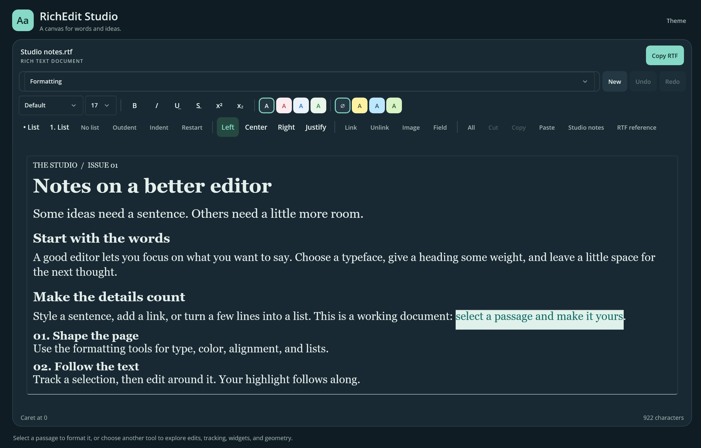
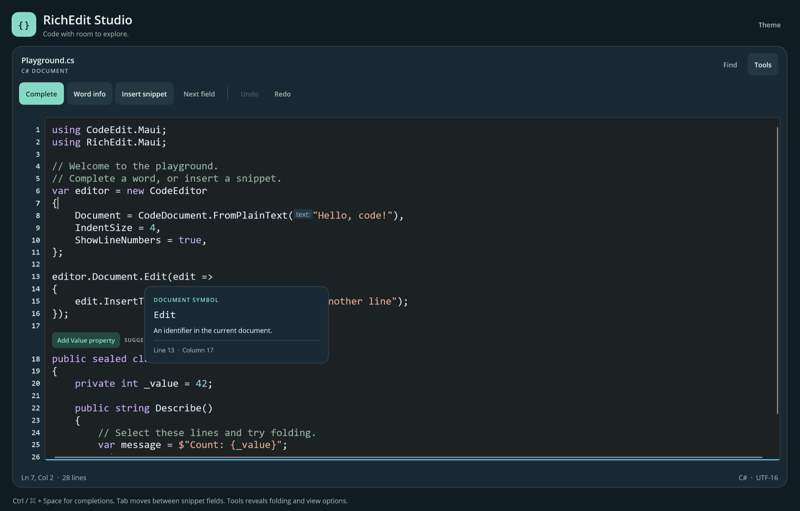

# Native editors for .NET MAUI

RichEdit.Maui provides rich-text editing with a live document model, RTF import and export, and document-owned undo history. CodeEdit.Maui builds a plain-text code editor on the same foundation, with line numbers, indentation, and extension APIs for language tools.

Both controls use native text input on Windows, Android, iOS, and Mac Catalyst.

## Rich-text editing

RichEditor supports character and paragraph formatting, lists, links, fields, and inline images. Document edits are atomic and share undo history with native typing.

## Code editing

CodeEditor supports syntax colors through decoration layers, source-range folding, and inline MAUI views. Language analysis and completion are supplied by your code.

[Source on GitHub](https://github.com/hez2010/RichEdit.Maui) · [RichEdit.Maui on NuGet](https://www.nuget.org/packages/RichEdit.Maui) · [CodeEdit.Maui on NuGet](https://www.nuget.org/packages/CodeEdit.Maui)
